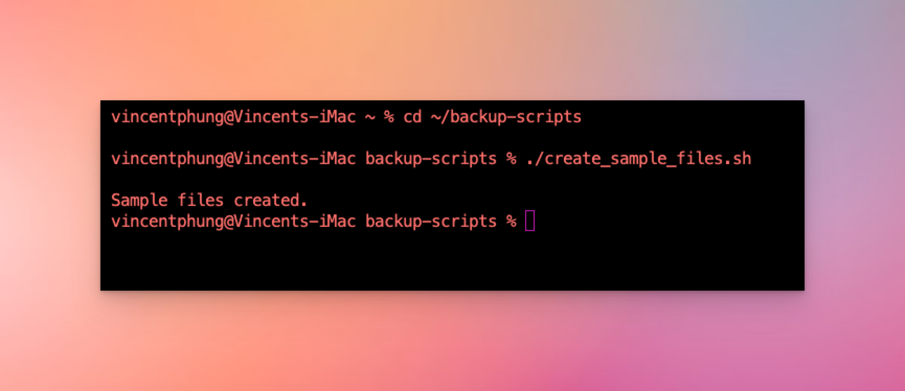
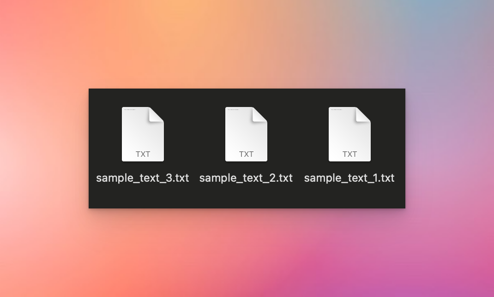
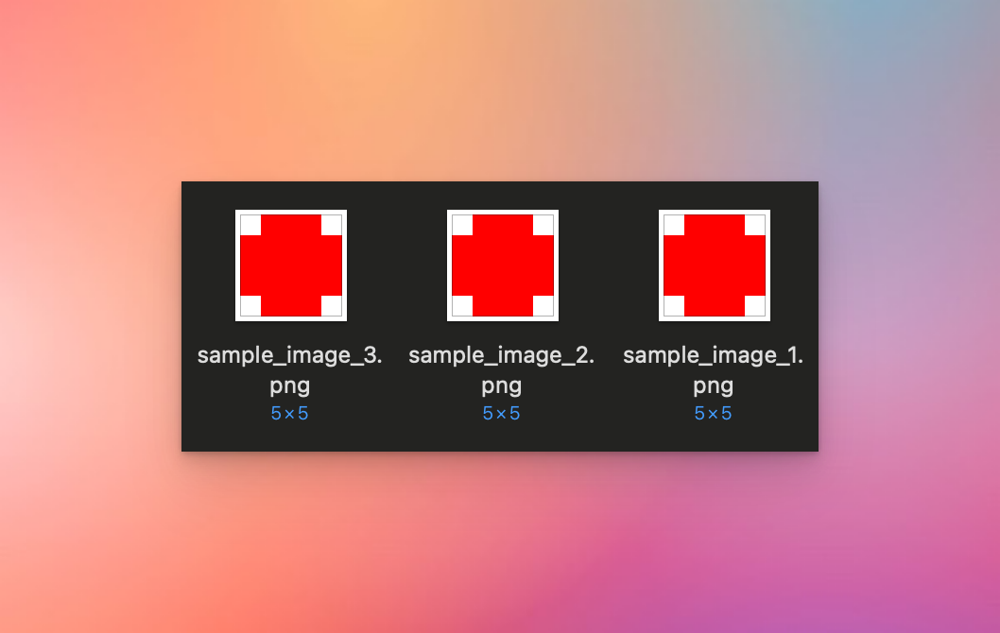
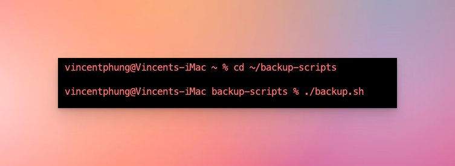
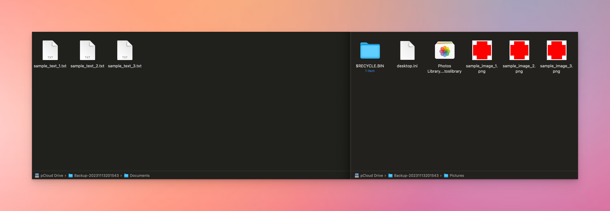

# pCloud Automated Backup System for macOS

This repository houses a collection of shell scripts tailored for macOS users, designed to automate various tasks including backing up specified directories to their pCloud Drive. The primary script runs daily, providing a reliable means to safeguard your important data in the cloud.

## Table of Contents
- [Prerequisites](#prerequisites)
- [Installation](#installation)
- [Configuration](#configuration)
- [Usage](#usage)
  - [Backup Execution](#backup-execution)
- [Monitoring](#monitoring)
- [Restoration Procedure](#restoration-procedure)
- [Troubleshooting Guide](#troubleshooting-guide)
- [Detailed Demonstration](#detailed-demonstration)
- [How to Contribute](#how-to-contribute)
- [Licensing](#licensing)
- [Acknowledgments](#acknowledgments)

## Prerequisites

- An active pCloud account with ample storage space.
- pCloud Drive must be installed and actively syncing on your macOS device. Ensure it's mounted correctly at the following location: `/Users/vincentphung/pCloud Drive`.

## Installation

1. Verify the operational status of your pCloud Drive on your Mac.
2. Obtain the scripts by cloning this repository or downloading it directly into a directory on your machine:

    ```bash
    git clone https://github.com/vincenthphung/backup-scripts.git ~/backup-scripts
    ```

3. Alter the script permissions to allow execution:

    ```bash
    chmod +x ~/backup-scripts/*.sh
    ```

## Configuration

Adjust the `backup.sh` script to specify which directories you wish to include in the backup process.

1. Open the script in a text editor:

    ```bash
    nano ~/backup-scripts/backup.sh
    ```

2. Amend the `SOURCE_DIRS` array to reflect the paths of the directories to be backed up:

    ```bash
    SOURCE_DIRS=("$HOME/Documents" "$HOME/Pictures")
    ```

## Usage

### Backup Execution

To perform a backup at any time:

```bash
~/backup-scripts/backup.sh
```

A cron job is employed to automate the backup script, configured to activate at 3:30 AM each day:

```bash
crontab -e
```

The cron schedule is delineated as:

```cron
30 3 * * * /Users/vincentphung/backup-scripts/backup.sh
```

## Monitoring

The script maintains a log of each backup attempt. To examine the most recent log entries:

```bash
cat ~/backup-scripts/backup.log
```

## Restoration Procedure

To restore files from a backup:

1. Open Finder and navigate to your pCloud Drive.
2. Identify and select the backup folder of choice, which will be timestamped.
3. Manually transfer the required files back to a location on your local system.

## Troubleshooting Guide

Should issues arise:

- Confirm the pCloud Drive is properly mounted and accessible.
- Check that your Mac did not enter sleep mode when the backup was scheduled.
- Peruse the `backup.log` file for any indications of errors or operation outcomes.

## Detailed Demonstration

This section provides a step-by-step visual demonstration of the scripts and their functionality.

### Creating Sample Files

First, we create some sample files in the Documents and Pictures directories to demonstrate the backup process.

1. **Run the `create_sample_files.sh` script:**
This script generates sample text and image files in the specified directories.



2. **Check the Sample Files in Documents:**
The Documents directory now contains several text files.



3. **Check the Sample Files in Pictures:**
The Pictures directory now contains several image files.



### Running the Backup Script

Next, we run the `backup.sh` script to back up these files to the pCloud Drive.

1. **Execute `backup.sh`:**
This script backs up the contents of the specified directories to the pCloud Drive.



### Backup Results in pCloud Drive

After running the backup script, we can see the results in the pCloud Drive.

1. **Open pCloud Drive:**
Navigate to the newly created backup folder to see the backed-up files.



### Backup Log File Contents

The script also logs its activity, which can be reviewed for additional information.

1. **Open the Log File:**
Review the `backup.log` file to see the detailed log entries created by the script.


(Optional) ### Cron Job Setup

If a cron job has been set up for automated backups, it can be displayed as follows.

1. **Cron Job Configuration:**
The `crontab -l` command shows the scheduled backup job.


By following these steps and reviewing the corresponding screenshots, you can gain a comprehensive understanding of how the backup system functions and ensures the safety of your important files.


## How to Contribute

Contributions are welcomed and greatly valued. Whether it's enhancing the scripts, improving documentation, or reporting issues—your input can significantly benefit the project. For a comprehensive guide on how to make contributions, please consult the [CONTRIBUTING.md](https://github.com/vincenthphung/backup-scripts/blob/master/CONTRIBUTING.md) file.

## Licensing

This project is disseminated under the terms of the MIT License. For further details, please refer to the [LICENSE.md](https://github.com/vincenthphung/backup-scripts/blob/master/LICENSE) file.

## Acknowledgments

- Kudos to the pCloud team for their robust and user-friendly cloud storage solution.
- Immense gratitude is extended to all the contributors who have tested, documented, and refined this backup system.
